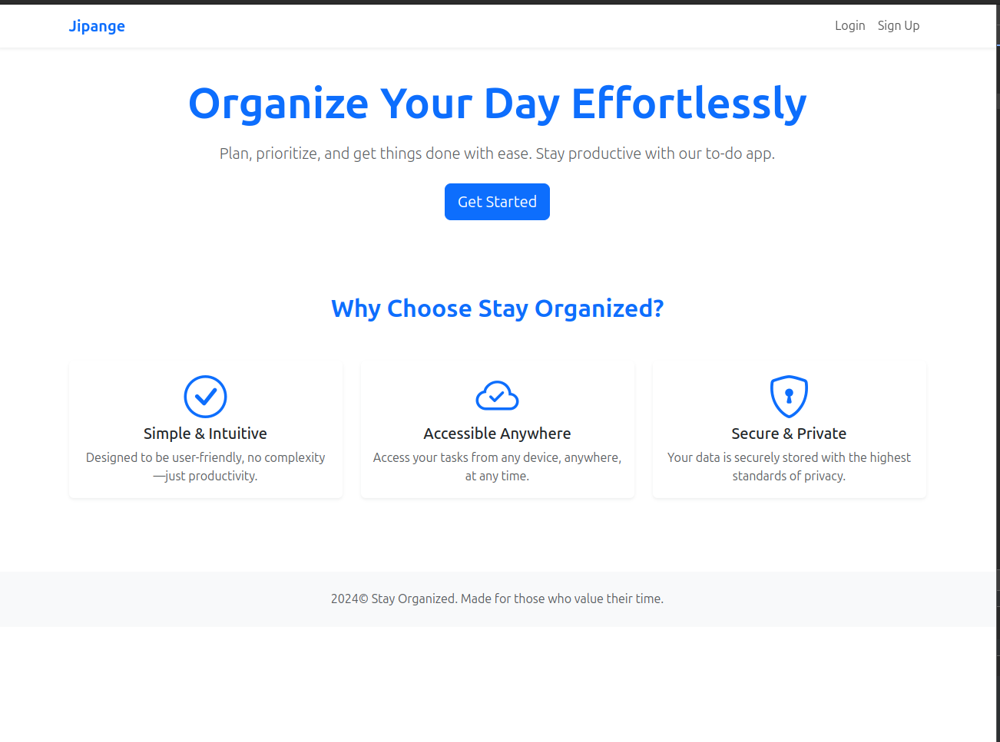
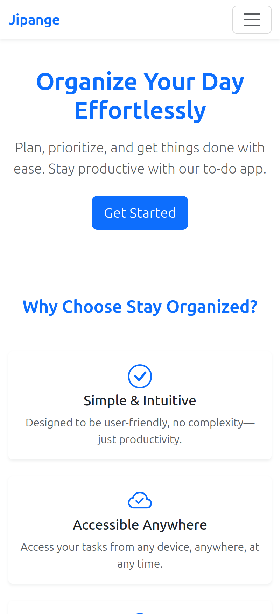

## To_DO APP

This is a simple to-do app that allows you to add, delete, and mark tasks as completed. It is built using Django and HTML(Bootstrap).

## How to setup

1. Clone the repository

```
git clone && cd
```

2. Create a virtual environment

```
virtualenv .venv
```

3. Activate the virtual environment

```
source .venv/bin/activate
```

4. Install the requirements

```
pip install -r requirements.txt
```

5. Copy the .env.example file to .env

```
cp .env.example .env
```

6. Make migrations

```
python manage.py makemigrations
python manage.py migrate
```

7. Run the server

```
python manage.py runserver
```

8. Open the browser and go to:

```
http://localhost:8000
```

## Screenshots



